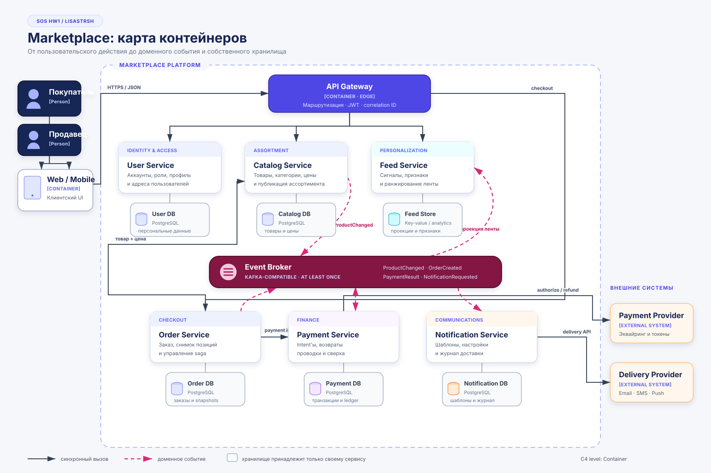

# SOS HW1 · Marketplace Blueprint

Работа о том, как разделить маркетплейс на самостоятельные сервисы и при этом не превратить первый релиз в распределенный монолит.

В репозитории зафиксирована целевая модель системы на уровне **C4 Container**, объяснены ключевые решения и собран один минимальный, но настоящий вертикальный срез — `Catalog Service` с Docker-образом и health-check.

## Паспорт решения

| Параметр | Значение |
|---|---|
| Учебная работа | SOS · Homework 1 |
| Репозиторий | `LisaStrsh/SOS_HW1` |
| Предметная область | Маркетплейс с персональной товарной лентой |
| Архитектурный стиль | Доменно-ориентированные сервисы |
| Уровень диаграммы | C4 Container |
| Запускаемая часть | Catalog Service |
| Публичный endpoint | `GET /health` |
| Основной способ запуска | Docker Compose |

## Замысел

У маркетплейса два главных участника:

- **покупатель** смотрит персональную ленту, создает заказ, оплачивает его и получает уведомления;
- **продавец** управляет ассортиментом и публикует карточки товаров.

Из этого пользовательского сценария выделены шесть бизнес-областей. Границы проведены не по техническим слоям и не по отдельным таблицам, а по ответственности, данным и характеру нагрузки.

```text
Покупатель / Продавец
          │
          ▼
     Web / Mobile
          │
          ▼
      API Gateway
          │
    ┌─────┼──────────┬─────────┐
    ▼     ▼          ▼         ▼
  User  Catalog     Feed     Order ───► Payment
                     ▲         │           │
                     └─────────┴─────┬─────┘
                              события
                                  │
                                  ▼
                           Notification
```

Схема выше показывает идею маршрутов, а полная версия со способами интеграции, внешними системами и отдельными хранилищами находится ниже.

## C4 Container

[](docs/c4-container.svg)

Сплошные стрелки на диаграмме обозначают синхронные запросы, пунктирные — доменные события. У каждого сервиса показано собственное хранилище: это важная часть решения, а не деталь реализации.

## Шесть сервисов и шесть четких ролей

### User Service — кто работает с системой

Отвечает за регистрацию, аутентификацию, профиль, адреса и роли покупателя или продавца. Остальные сервисы не получают прямой доступ к пользовательской базе.

### Catalog Service — что можно купить

Хранит карточки товаров, категории, атрибуты, актуальные цены и состояние публикации. Это источник истины о текущем ассортименте продавцов.

### Feed Service — что показать первым

Собирает сигналы поведения и формирует индивидуальный порядок товаров. Он отделен от каталога, поскольку лента имеет другой профиль чтения и ее алгоритмы меняются чаще.

### Order Service — что именно покупают

Владеет checkout-сценарием и жизненным циклом заказа. Вместе с заказом сохраняется снимок названия и цены позиции, чтобы последующее изменение каталога не переписало историю покупки.

### Payment Service — как подтверждается оплата

Создает платежные намерения, обрабатывает авторизацию и возвраты, ведет проводки и сверку с провайдером. Финансовые данные вынесены в отдельный защищенный контур.

### Notification Service — как сообщить результат

Управляет шаблонами, предпочтениями каналов и заданиями на email, SMS и push. Проблема с отправкой сообщения не должна отменять уже созданный заказ.

## Кому принадлежат данные

Правило проекта простое: **записывать данные может только сервис-владелец**.

| Источник истины | Что хранит | Чего не хранит |
|---|---|---|
| User DB | Учетные записи, роли, профиль, адреса, ссылки на IdP или хэши credentials | Заказы, рекомендации и платежные операции |
| Catalog DB | Товары, категории, атрибуты, цены, статус публикации | Историю заказов и платежей |
| Feed Store | Псевдонимные сигналы, признаки, версии алгоритма, рекомендации | Контакты пользователя и мастер-копию товара |
| Order DB | Заказы, статусы и неизменяемые снимки позиций | Банковские проводки и актуальный каталог |
| Payment DB | Intent'ы, транзакции, возвраты, ledger и ключи идемпотентности | Полные данные карты |
| Notification DB | Шаблоны, настройки каналов, очередь и результат доставки | Истинный статус заказа |

На старте базы могут физически находиться в одном PostgreSQL-кластере, но логически остаются раздельными: разные схемы, пользователи и права доступа. Межсервисные SQL-запросы и внешние ключи запрещены. Копия чужих данных допустима только как локальная проекция, полученная через API или событие.

## Как работает персональная лента

Для первой версии не нужна тяжелая ML-платформа. Выбран объяснимый алгоритм, который можно постепенно усложнять:

1. Gateway принимает просмотры и клики пользователя.
2. Брокер доставляет Feed Service события `ProductChanged` и `OrderCreated`.
3. Feed Service поддерживает локальную проекцию доступных товаров.
4. Фоновая задача считает интерес пользователя к категориям и продавцам.
5. Онлайн-ранжирование объединяет этот интерес со свежестью и общей популярностью.
6. Новый или анонимный пользователь видит популярные товары выбранной категории.

Версия алгоритма и набор признаков сохраняются вместе с результатом. Это позволяет воспроизводить выдачу и корректно проводить A/B-тесты. Если Feed Service временно недоступен, пользователь может перейти к каталогу, а оформление заказа продолжает работать.

## Два режима взаимодействия

### Когда нужен ответ сразу

HTTP/gRPC используется внутри пользовательского запроса:

- чтение каталога и ленты;
- создание заказа;
- получение снимка товара и цены;
- создание платежного намерения.

Для таких вызовов обязательны timeout, circuit breaker и ограниченные повторы. Автоматически повторять можно только идемпотентную операцию.

### Когда можно обработать позже

Через Kafka-compatible broker распространяются изменения каталога, результаты платежей, сигналы для рекомендаций и задания на уведомления.

Доставка считается **at least once**, поэтому каждый потребитель умеет распознавать повтор по `event_id`. Состояние и событие фиксируются согласованно через transactional outbox. Сквозной ACID-транзакции нет: checkout моделируется как saga, а ошибочные шаги компенсируются — например, незавершенное платежное намерение отменяется.

## Почему выбран именно такой масштаб декомпозиции

До финального варианта рассматривались три конфигурации.

| Кандидат | Сильная сторона | Основной риск | Решение |
|---|---|---|---|
| Модульный монолит | Самый простой запуск и сквозные транзакции | Общая БД и единый релиз быстро связывают домены | Не выбран |
| Много мелких микросервисов | Максимальная автономность и точечное масштабирование | Слишком много контрактов, сетевых вызовов и эксплуатации для текущего объема | Не выбран |
| Шесть доменных сервисов | Баланс независимости и управляемой сложности | Нужны события, трассировка и работа с eventual consistency | **Выбран** |

Модульный монолит был бы хорош для самой ранней проверки идеи, но хуже изолирует платежи и не позволяет независимо развивать Feed. Противоположный вариант с отдельными Product, Category, Pricing, Cart, Ledger, Profile и другими небольшими сервисами создает сложность раньше, чем для нее появляется измеримая причина.

Шесть крупных bounded context'ов соответствуют языку бизнеса и оставляют путь для эволюции. Делить их дальше стоит только при появлении отдельной команды, конфликтующего профиля нагрузки, специальных требований безопасности или заметно различающейся скорости изменений.

## Надежность и наблюдаемость

Архитектура исходит из того, что сеть и внешние провайдеры иногда отказывают. Поэтому в решение заложены:

- идемпотентность команд и обработчиков событий;
- ключи дедупликации для повторной доставки;
- timeout и circuit breaker для синхронных зависимостей;
- transactional outbox для надежной публикации;
- correlation ID от Gateway до фоновых обработчиков;
- структурированные логи, метрики и distributed tracing;
- компенсации saga вместо распределенной транзакции.

## Запускаемый фрагмент

В `catalog-service` нет бизнес-методов каталога — это намеренное ограничение первого этапа. Сервис подтверждает, что контейнер собирается, запускается от непривилегированного пользователя и отвечает на техническую проверку состояния.

### Запуск в Docker

```bash
docker compose up --build -d
```

Проверка:

```bash
curl -i http://localhost:8080/health
```

Ожидаемый ответ:

```http
HTTP/1.0 200 OK
Content-Type: application/json; charset=utf-8

{"status":"ok","service":"catalog-service"}
```

Состояние контейнера:

```bash
docker compose ps
```

Остановка:

```bash
docker compose down
```

Если `8080` уже занят:

```bash
CATALOG_PORT=8081 docker compose up --build -d
curl http://localhost:8081/health
```

### Запуск без контейнера

```bash
PYTHONPATH=catalog-service/src python3 -m catalog_service
```

### Тесты

```bash
PYTHONPATH=catalog-service/src python3 -m unittest discover \
  -s catalog-service/tests -v
```

Проверяются успешный health-check и ответ `404` для неизвестного маршрута.

## Архитектурный журнал

Решения, которые важно сохранить вместе с контекстом и последствиями, вынесены отдельно:

- [ADR-001: доменно-ориентированная декомпозиция](docs/adr/001-domain-services.md)
- [ADR-002: отдельная БД на сервис и событийная интеграция](docs/adr/002-data-and-integration.md)

## Навигация по репозиторию

```text
SOS_HW1/
├── README.md                         # обзор и обоснование решения
├── docker-compose.yml                # локальный запуск
├── docs/
│   ├── c4-container.svg              # полная контейнерная схема
│   └── adr/
│       ├── 001-domain-services.md    # почему выбраны крупные домены
│       └── 002-data-and-integration.md
└── catalog-service/
    ├── Dockerfile
    ├── src/catalog_service/
    │   ├── __init__.py
    │   ├── __main__.py
    │   └── server.py
    └── tests/test_health.py
```

## Границы текущей версии

- Цена пока относится к Catalog Service. Отдельный Pricing Service понадобится только для сложного динамического ценообразования.
- Остатки не входят в объем работы. В дальнейшем ими сможет владеть Inventory Service, участвующий в checkout-saga.
- Gateway проверяет подпись access token, но источником пользователей и ролей остается User Service.
- Технологии будущих сервисов на диаграмме отражают предполагаемые роли, а не окончательный стек. Он должен выбираться после появления требований к нагрузке и SLO.

---

**SOS HW1 · Marketplace Architecture · LisaStrsh**
